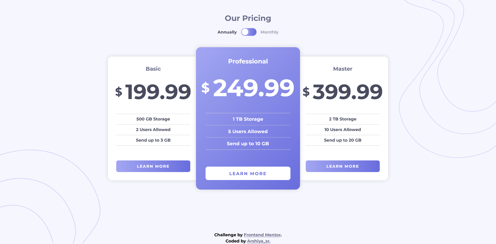
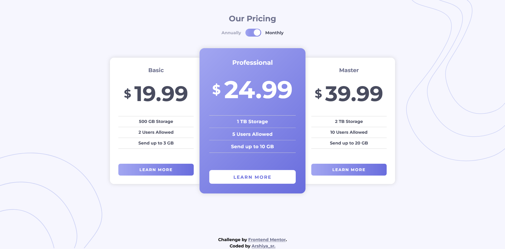
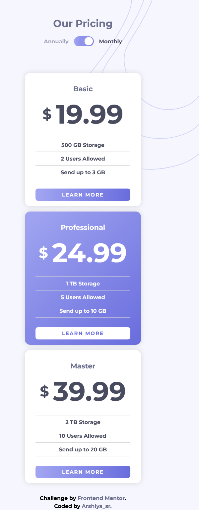

# Frontend Mentor - Pricing component with toggle solution

This is a solution to the [Pricing component with toggle challenge on Frontend Mentor](https://www.frontendmentor.io/challenges/pricing-component-with-toggle-8vPwRMIC). Frontend Mentor challenges help you improve your coding skills by building realistic projects. 

## Table of contents

- [Overview](#overview)
  - [The challenge](#the-challenge)
  - [Screenshot](#screenshot)
  - [Links](#links)
- [My process](#my-process)
  - [Built with](#built-with)
  - [Process](#process)
  - [What I learned](#what-i-learned)
  - [Continued development](#continued-development)
  - [Useful resources](#useful-resources)
  - [AI Collaboration](#ai-collaboration)
- [Author](#author)
- [Acknowledgments](#acknowledgments)

## Overview

### The challenge

Users should be able to:

- View the optimal layout for the component depending on their device's screen size
- Control the toggle with both their mouse/trackpad and their keyboard
- **Bonus**: Complete the challenge with just HTML and CSS

### Screenshot

preview desktop annually: 
preview desktop monthly: 

preview mobile: 

### Links

- Solution URL: [solution URL](https://github.com/arshiya-sr/frontend-mentor-Pricing-component-with-toggle-Project)
- Live Site URL: [live site URL](https://arshiya-sr.github.io/frontend-mentor-Pricing-component-with-toggle-Project/)

## My process

### Built with

- Semantic HTML5 markup
- CSS custom properties
- Advanced CSS
- Flexbox
- Mobile-first workflow
- Media queries
- Deepseek AI

### Process

This project didn't have a special build process because it didn't have any particular challenges. But building it was really enjoyable and fascinating for me, and I enjoyed the whole process because I already knew most of its parts and also solved a few new things. 

As always, I started by building the HTML structure based on the project's desktop design, and I built the structure with semantics in mind as well as the annual/monthly price toggle button. After that, I added the CSS reset and custom properties and started building the mobile layout. 

Once the mobile layout was complete, I finished designing the price toggle button so that the prices change when it's checked and unchecked. Actually, the core functionality of this button works with the `:has()` pseudo-class, and that way it works easily without JavaScript, and it's very easy to change its appearance based on the button's state without JavaScript—and even the appearance of any other element on the page. The bonus of this project was doing it without JavaScript. 

After that, I built the desktop layout, then created the interactive animations and made the appearance more attractive and beautiful. And finally, I optimized the project for keyboard navigation as well.

### What I learned

The most important thing I learned in this project was how to design such attractive components without JavaScript. And now that I’ve managed to build a checkbox like this, I can build one with a much more complex and better appearance as well.

### Continued development

Probably no additional or special work will be done on this project in the future. However, debugging and optimization will definitely be done after receiving the Frontend Mentor report and other people's comments and reviews.

### Useful resources

- [Deepseek AI](https://www.deepseek.com) - DeepSeek has helped me immensely on my learning journey—it's far better to use it for truly understanding concepts than for just getting answers and bypassing the work. And it helped me a lot more on this project.
- [github copilot AI](https://github.com/copilot) - GitHub Copilot has also been a huge help, especially when it comes to coding.
- [freecodecamp free online course](https://www.freecodecamp.org) - I gained my web development knowledge through freeCodeCamp, which is completely free and packed with resources: theory, labs, workshops, quizzes, and even review projects that help you master each topic. This project itself comes from freeCodeCamp, so a big thank-you to them.

### AI Collaboration

- What tools did you use (e.g., ChatGPT, Claude, GitHub Copilot)? i only used deepseek and github copilot AI a lot.
- How did you use them (e.g., debugging, generating boilerplate, brainstorming solutions)? i used it to help me understand the structure and debug small pieces of codes. also github copilot helped me nearly in all of it. It's really good.

## Author

- github - [my github](https://github.com/arshiya-sr)
- Frontend Mentor - [my frontend mentor](https://www.frontendmentor.io/profile/arshiya-sr)
- FreeCodeCamp - [my freecodecamp](https://www.freecodecamp.org/arshiya_sr)

## Acknowledgments

thank to Frontend Mentor for this awesome Project/Challenge, and thank to you for paying your time and attention to my project. I'd be so happy to receive your advice and recommendations.
Hope you a good day ♥
